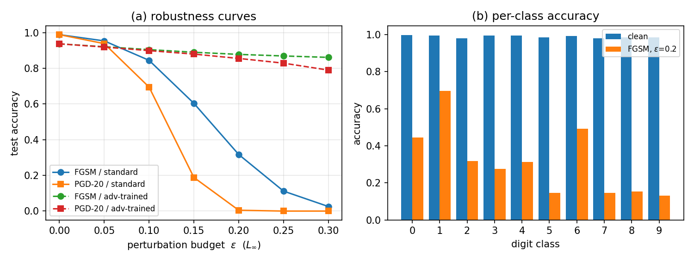

# Adversarial Attacks and Defenses on MNIST

CDS521 Foundation of AI — Course Dissertation (2025-2026 Term 2)

A systematic study of the Fast Gradient Sign Method (FGSM), Projected Gradient Descent (PGD), and Madry-style adversarial training on MNIST, implemented in PyTorch and runnable on a single consumer GPU (or CPU).

**Author:** Wang Wenxuan (Student ID: 1397228)
**Deadline:** 24 April 2026
**Full report:** [`CDS521_Dissertation_1397228_WangWenxuan.pdf`](CDS521_Dissertation_1397228_WangWenxuan.pdf)

---

## Headline Results

| Model | Clean acc | FGSM @ ε = 0.3 | PGD-20 @ ε = 0.3 |
|---|---:|---:|---:|
| Standard CNN | **98.86 %** | 2.56 % | **0.00 %** |
| PGD adversarially trained | 93.71 % | **86.13 %** | **79.00 %** |

PGD-20 uses the Madry protocol (α = 2.5 ε / T, random start) — it reaches the full ε-ball and saturates the standard model at 0 % by ε = 0.25. Adversarial training recovers 79 % accuracy under this strong attack at ε = 0.3, at a cost of ≈ 5.2 pp clean accuracy and 6.6× training time.



---

## Repository Layout

```
.
├── CDS521_Dissertation_1397228_WangWenxuan.pdf   # Final submission (3 pages)
├── report.tex                                    # LaTeX source of the report
├── report.md                                     # Markdown mirror of the report
├── experiment.py                                 # Reproducible end-to-end experiment
├── dissertation_plan.md                          # Planning + design notes
├── outputs/
│   ├── results.json                              # All numerical results
│   ├── table_cost.csv                            # Attack compute-cost table
│   ├── fig1_samples.png                          # Adversarial samples
│   ├── fig2_curves.png                           # Robustness curves + per-class accuracy
│   └── fig3_confusion.png                        # Confusion matrices
└── CDS521 Course Dissertation 25-26 term2.pdf    # Original assignment brief
```

## How to Reproduce

```bash
# 1. install dependencies (CUDA PyTorch strongly recommended)
pip install torch torchvision --index-url https://download.pytorch.org/whl/cu121
pip install matplotlib seaborn scikit-learn numpy

# 2. run the full pipeline (downloads MNIST on first run)
python experiment.py
```

Runtime on an NVIDIA RTX 2050 (4 GB): **≈ 3 minutes** end-to-end. On CPU the same script finishes in ≈ 20 minutes.

## What `experiment.py` Does (7 experiments, 1 file)

| Step | Description |
|---|---|
| E1 | Train a 421 K-param CNN on MNIST for 3 epochs (clean baseline) |
| E2 | Sweep FGSM accuracy over ε ∈ {0, .05, …, .30} on the clean model |
| E3 | Sweep PGD-20 accuracy over the same ε grid |
| E4 | Train an adversarially robust model via PGD-7, α = ε/4, 5 epochs; re-run E2/E3 on it |
| E5 | Compute confusion matrices before and after FGSM at ε = 0.2 |
| E6 | Compute per-class accuracy at ε = 0.2 for the clean model |
| E7 | Benchmark FGSM vs PGD-7 vs PGD-20 wall-clock cost on 1024 samples |

All numeric results land in `outputs/results.json`; all figures and the cost table land in `outputs/`.

## Key References

1. Goodfellow, Shlens, Szegedy. *Explaining and Harnessing Adversarial Examples.* ICLR 2015.
2. Madry et al. *Towards Deep Learning Models Resistant to Adversarial Attacks.* ICLR 2018.
3. NIST. *Adversarial Machine Learning: A Taxonomy and Terminology of Attacks and Mitigations*, NISTIR 8269 draft, 2021.

(Full 13-reference list in the report.)

## License

MIT for code. The report PDF is for academic submission.
