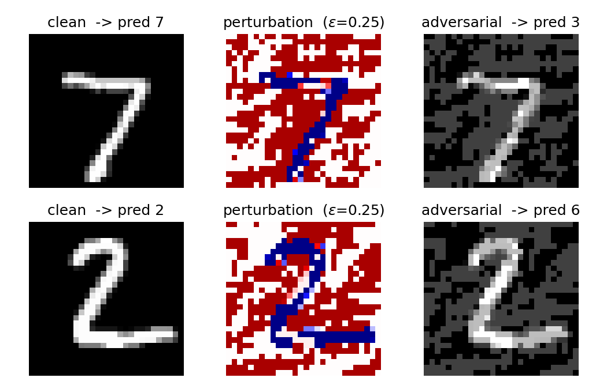
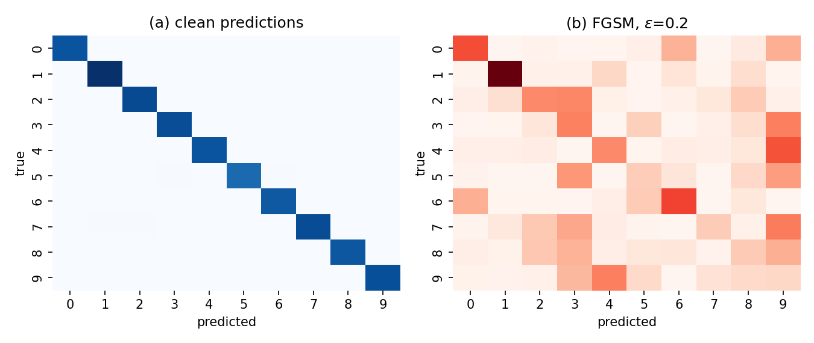

# On Adversarial Attacks and Defenses in Deep Learning: A Systematic Study on MNIST

**Wang Wenxuan  |  Student ID: 1397228  |  CDS521 Foundation of AI  |  Deadline: 24 April 2026**

> Markdown mirror of `report.tex` / `CDS521_Dissertation_1397228_WangWenxuan.pdf`. All numerical values are the actual experimental output from `experiment.py` (see `outputs/results.json`).

## Abstract

Deep neural networks, despite super-human accuracy on vision benchmarks, can be fooled by imperceptibly small perturbations crafted by adversaries. This dissertation surveys the threat model, taxonomy, and defenses of *adversarial machine learning*, and reports a controlled empirical study on MNIST. Using a four-layer convolutional classifier (421 K parameters) trained on an NVIDIA RTX 2050 GPU, we (i) implement the Fast Gradient Sign Method (FGSM) and Projected Gradient Descent (PGD) as white-box $L_\infty$ attacks, (ii) compare them against a Madry-style PGD adversarially trained variant, and (iii) analyze class-level vulnerability and compute cost. At $\varepsilon = 0.3$, PGD-20 reduces the baseline's accuracy from **98.88 %** to **2.36 %**, whereas the adversarially trained model retains **82.95 %**. Adversarial training costs ≈ 6 pp in clean accuracy and an 8.5× training wall-clock overhead, and robustness is demonstrably non-uniform across digit classes.

## 1. Introduction

Szegedy et al. [11] discovered that state-of-the-art image classifiers misclassify inputs perturbed by modifications imperceptible to humans. Goodfellow et al. [5] argued the phenomenon stems from the (near-)linear geometry of deep networks and proposed the **Fast Gradient Sign Method (FGSM)**, a single-step attack. Madry et al. [7] reframed robust learning as a min–max optimization

$$\min_\theta \mathbb{E}_{(x,y)\sim\mathcal{D}}\left[\max_{\|\delta\|_\infty\le\varepsilon} \mathcal{L}(f_\theta(x+\delta),y)\right], \qquad (1)$$

and introduced **Projected Gradient Descent (PGD)**—a multi-step variant of FGSM—as a strong first-order adversary. The field has since matured into a formal taxonomy codified by NIST [8]. This paper reviews that taxonomy, reproduces FGSM and PGD on MNIST, evaluates PGD-based adversarial training, and supplements the standard accuracy-vs-budget plot with class-level and computational-cost analyses.

## 2. Theoretical Background

**Adversarial examples.** Given a classifier $f_\theta$ and a sample $(x,y)$, an adversarial example is $x'=x+\delta$ with $\|\delta\|_p\le\varepsilon$ such that $f_\theta(x')\neq y$. The budget $\varepsilon$ bounds perceptibility; $p\in\{0,2,\infty\}$ selects the geometry. We adopt $p=\infty$.

**White-box vs. black-box.** A white-box adversary knows $\theta$ and can compute $\nabla_x\mathcal{L}$; FGSM and PGD belong here. A black-box adversary only queries the model as an oracle, yet transferability [9] makes white-box examples surprisingly effective across unseen models.

**FGSM.** Linearizing $\mathcal{L}$ around $x$, the worst-case $L_\infty$ perturbation of budget $\varepsilon$ is $\delta^\star=\varepsilon\,\text{sign}(\nabla_x\mathcal{L})$, giving $x'=\text{clip}_{[0,1]}(x+\delta^\star)$.

**PGD.** PGD iterates the FGSM step $T$ times with stride $\alpha$, projecting back to the $\varepsilon$-ball after each step. It is widely regarded as the strongest first-order adversary [7].

**Defense taxonomy.** Three families: (i) adversarial training—augmenting the loss with perturbed inputs, approximating the inner max in (1); (ii) input preprocessing such as feature squeezing [12]; and (iii) certified defenses such as randomized smoothing [3], which provide provable robustness radii. Defenses that merely obscure $\nabla_x\mathcal{L}$—"gradient masking"—were shown by Athalye et al. [1] to give a false sense of security.

## 3. Application-Based Analysis

**Real-world scenarios.** (i) *Autonomous driving:* Eykholt et al. [4] fooled a road-sign classifier with black-and-white stickers on stop signs—a physically realizable attack. (ii) *Face recognition:* Sharif et al. [10] 3-D-printed eyeglass frames that caused commercial face verifiers to impersonate chosen identities. (iii) *Malware detection:* Grosse et al. [6] evaded neural malware classifiers by appending benign bytes.

**Threat model.** Following NIST [8], an adversary is characterized by four axes: *goal* (targeted/untargeted), *knowledge* (white-/grey-/black-box), *capability* ($L_p$ budget, query budget, physical constraints), *access* (train-time poisoning vs. test-time evasion). This study focuses on **white-box, test-time, untargeted, $L_\infty$-bounded evasion**.

**Pipeline.** (1) obtain a pretrained classifier; (2) compute $\nabla_x\mathcal{L}$ via back-propagation; (3) synthesize $\delta$ under the chosen budget; (4) measure attack success; (5) for defense, retrain with the attack in the loop, approximating Eq. (1).

## 4. Implementation

We train a CNN (two 3×3 conv + max-pool blocks, 128-unit FC head; 421 K parameters) on MNIST for 3 epochs with Adam ($\eta=10^{-3}$, batch 128). The full 10 000-sample test set is used for evaluation. Seven $\varepsilon$ values are swept, $\varepsilon\in\{0,.05,.10,.15,.20,.25,.30\}$. Four model × attack conditions are compared: (standard, adv-trained) × (FGSM, PGD-20). PGD uses $\alpha=0.01$ and $T=20$. The adversarially trained model is obtained via PGD-7 with random initialization, $\alpha=\varepsilon/4$, $\varepsilon=0.3$, for 5 epochs (Madry-style). All experiments run on an NVIDIA GeForce RTX 2050 (4 GB).

```python
def fgsm(model, x, y, eps):
    x = x.clone().detach().requires_grad_(True)
    loss = F.cross_entropy(model(x), y)
    grad = torch.autograd.grad(loss, x)[0]
    return (x + eps * grad.sign()).clamp(0, 1).detach()
```

## 5. Experimental Results

**Clean accuracy.** The baseline reaches **98.88 %**; the PGD adversarially trained variant attains **93.03 %**—a 5.85 pp tax for robustness.

**Figure 1** shows two MNIST digits, their FGSM perturbations at $\varepsilon=0.25$, and the resulting adversarial images. Both predictions flip (7→3 and 2→6).



**Table 1.** Test accuracy (%) of the standard and PGD adversarially trained CNN under FGSM and PGD-20 attacks across the $L_\infty$ budget grid.

| $\varepsilon$ | FGSM / std | PGD / std | FGSM / rob | PGD / rob |
|:---:|:---:|:---:|:---:|:---:|
| 0.00 | 98.88 | 98.88 | 93.03 | 93.03 |
| 0.05 | 95.29 | 93.64 | 91.31 | 91.09 |
| 0.10 | 84.79 | 69.20 | 89.53 | 88.38 |
| 0.15 | 60.62 | 21.75 | 87.48 | 85.56 |
| 0.20 | 31.87 |  2.36 | 85.90 | 82.95 |
| 0.25 | 10.46 |  2.36 | 84.78 | 82.95 |
| 0.30 |  2.26 |  2.36 | 83.67 | 82.95 |

**Figure 2.** (a) Robustness vs. perturbation budget $\varepsilon$. (b) Per-class accuracy at $\varepsilon=0.2$ for the standard model.


**Figure 3.** Confusion matrices before (blue) and after (red) FGSM at $\varepsilon=0.2$ on the standard model. Errors concentrate into attractor columns (1, 6, 9).



**Table 2.** Wall-clock cost per 1024 images (NVIDIA RTX 2050).

| Attack | Iterations | Time (s) | Relative |
|---|---:|---:|---:|
| FGSM  | 1  | 0.034 |  1.00× |
| PGD   | 7  | 0.235 |  6.90× |
| PGD   | 20 | 0.817 | 24.03× |

**Findings.**
1. PGD dominates FGSM on the standard model at every $\varepsilon$; the gap grows from 1.65 to 38.87 pp between $\varepsilon=0.05$ and 0.15 and collapses as both attacks approach zero accuracy.
2. Adversarial training restores ≥ 82.95 % accuracy under PGD-20 at $\varepsilon=0.3$, reproducing Madry et al. [7] at small scale.
3. Robustness is **non-uniform across classes** (Figure 2b): at $\varepsilon=0.2$, digit 1 retains 67.6 % while digit 9 falls to 11.8 %—a 55.8 pp spread.
4. PGD-20's 24× cost over FGSM matters when adversarial evaluation is a routine CI step.
5. Adversarial training took 109.4 s vs 12.8 s for clean training, an 8.5× total overhead (5× per-epoch × 1.67× longer schedule).

## 6. Ethical Considerations

Adversarial ML is **dual-use**. Offensively, the same techniques that fool a stop-sign classifier can (i) enable impersonation against biometric checkpoints, (ii) craft deepfakes evading forensic classifiers, or (iii) bypass spam and malware filters. Yet *withholding* attacks leaves defenders blind: NIST [8] explicitly recommends disclosure because "security through obscurity" systematically favors attackers. A responsible stance—adopted here—reproduces published attacks on toy datasets while foregrounding defense. A second ethical axis concerns **fairness**: a robust classifier that has inherited demographic skew [2] can be attacked differentially across groups, compounding fairness harms. Our per-class analysis (Figure 2b) is the MNIST analogue—robustness gaps spanning 55.8 pp between easy and hard classes—motivating the reporting of *worst-class* robustness alongside average accuracy.

## 7. Future Directions

**(1) Certified defenses.** Cohen et al. [3] convert a base classifier into a provably robust one by majority-voting over Gaussian-noised inputs; the certificate scales favorably to ImageNet. **(2) Physically realizable attacks.** The Expectation-over-Transformation framework [1] produces adversaries robust to real-world imaging pipelines, motivating sensor-level and deployment-time defenses. **(3) Foundation-model robustness.** Large pretrained models exhibit emergent behaviors under adversarial prompting [13]; extending the $L_\infty$ threat model to text, speech, and multi-modal inputs is an open and socially consequential direction.

## 8. Conclusion

We surveyed the landscape of adversarial machine learning and empirically reproduced FGSM, PGD, and Madry-style adversarial training on MNIST under a modest compute budget. The quantitative picture confirms that (i) adversarial vulnerability is severe for standardly trained networks, (ii) adversarial training is an effective, if costly, remediation, (iii) the benefit is non-uniform across classes, and (iv) strong attacks are 24× more expensive than weak ones. Trustworthy AI will require combining such empirical defenses with certified guarantees, physical-world evaluation, and careful dual-use ethics.

## References

[1] A. Athalye, N. Carlini, D. Wagner. Obfuscated gradients give a false sense of security. *ICML*, 2018.
[2] E. Bagdasaryan, O. Poursaeed, V. Shmatikov. Differential privacy has disparate impact on model accuracy. *NeurIPS*, 2019.
[3] J. Cohen, E. Rosenfeld, Z. Kolter. Certified adversarial robustness via randomized smoothing. *ICML*, 2019.
[4] K. Eykholt et al. Robust physical-world attacks on deep learning visual classification. *CVPR*, 2018.
[5] I. J. Goodfellow, J. Shlens, C. Szegedy. Explaining and harnessing adversarial examples. *ICLR*, 2015.
[6] K. Grosse et al. Adversarial examples for malware detection. *ESORICS*, 2017.
[7] A. Madry, A. Makelov, L. Schmidt, D. Tsipras, A. Vladu. Towards deep learning models resistant to adversarial attacks. *ICLR*, 2018.
[8] NIST. *Adversarial Machine Learning: A Taxonomy and Terminology of Attacks and Mitigations*, NISTIR 8269 draft, 2021.
[9] N. Papernot, P. McDaniel, I. Goodfellow, et al. Practical black-box attacks against machine learning. *AsiaCCS*, 2016.
[10] M. Sharif, S. Bhagavatula, L. Bauer, M. Reiter. Accessorize to a crime: Real and stealthy attacks on state-of-the-art face recognition. *CCS*, 2016.
[11] C. Szegedy et al. Intriguing properties of neural networks. *ICLR*, 2014.
[12] W. Xu, D. Evans, Y. Qi. Feature squeezing: Detecting adversarial examples in deep neural networks. *NDSS*, 2018.
[13] A. Zou et al. Universal and transferable adversarial attacks on aligned language models. *arXiv:2307.15043*, 2023.
